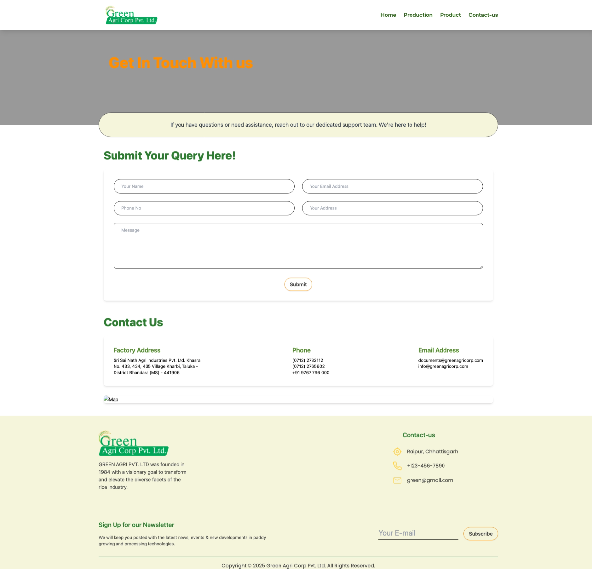

<!-- Green agri content -->
# Heading
Manufacturing and distributing premium-quality rice to aspiring nations for over 50 years.

### Sub-Heading
With India's largest production facility, we proudly export over 300,000 tonnes of rice annually to 25 countries worldwide.

<!-- product -->
## Product-heading
A Symphony of Premium Rice Varieties

We source organic paddy directly from farmers, crafting premium rice and maize while repurposing husk by-products into valuable products.

<!-- About us -->
## Who We Are
With the largest production facility in India, we export over 300 thousand tonnes annually to 25 different countries.

We believe in keeping up with cutting-edge technology of our rice plant infrastructure and processing machinery. Our total production capacity of boiled paddy crushing is 1600 metric tons per day.

We have developed warehouses for storing and ageing rice. For the domestic market, rice ageing of 1 to 2 years is done for JSR and HMT rice. For short-term storage of paddy, we use Brock Silos.

## A Global Network, at Local Prices.
With operations in 8 major ports and ICDs’ of India, We supply rice to more than 25 countries all around the World.

We supply rice to more than 25 countries all around the World. Countries like Bangladesh, South Africa, West Africa, East Africa, Gulf, Far East, Middle East, Ivory Coast, Guinea are few of them.

<!-- Detail -->
- **Largest Rice Mill in Raipur**

- **State-of-the-Art Facility**  
  Equipped with advanced technology and cutting-edge equipment.  

- **Convenient Location**  
  Strategically positioned for seamless global export operations.  

- **Commitment to Quality and Safety**  
  Adheres to SQL certification standards, ensuring top-notch quality.  

- **Global Presence**  
  Proudly serving customers across the globe.  

- **Timely Deliveries**  
  Dedicated to ensuring on-time delivery every time.

<!-- footer -->

## Green Corp Logo  

**GREEN AGRI PVT. LTD**  
Founded in 1984 with a visionary goal to transform and elevate the diverse facets of the rice industry.  

---

### Contact Us  
- **Location**: Raipur, Chhattisgarh  
- **Phone**: +123-456-7890  
- **Email**: green@gmail.com  

---

### Stay Updated with Our Newsletter  
Sign up to receive the latest news, events, and updates on advancements in paddy growing and processing technologies.  

- **Your E-mail**  
  Enter your email address and stay informed.  

**[Subscribe Now](#)**  

<!-- Production page -->

We have the largest production capacity in Central India in the non-basmati segment. Our rice mills units are situated in Raipur and Delhi.

## Production Capacity

We have a total production capacity of boiled paddy crushing of about 1600 metric tons per day.

Our rice mill units are located in close proximity to the paddy market (mandi). Our Sourcing & Processing units are strategically located between paddy hubs, which helps us form a seamless transportation network and helps us to procure the highest quality of paddy at affordable rates all-round the year.

## Cutting-Edge Production Facilities  

Our production facilities adhere to **Industry 4.0 standards** and are equipped with a fully automated **PLC-based system** from Allen Bradley. The entire process is designed to eliminate human touch in handling rice grains, ensuring unmatched hygiene and precision.  

From manufacturing to packaging and loading, every step is fully automated and meticulously monitored by our quality check experts, ensuring superior quality and consistency in every batch.

## Processes  

### Focus on Boiled and Steam Rice  
- **90% of Production**: Our production primarily consists of boiled and steam rice, processes that we have perfected over the years.  
- **Proprietary Techniques**: Through extensive research and experience, we have developed unique methods for steaming and parboiling rice. Our dryers and cookers are custom-designed to align with our innovative production techniques.  

### Maintaining Quality Standards  
- **Water Quality**: The quality of parboiled rice—its color, taste, odor, and cooking results—depends significantly on the quality of water used. To ensure superior quality, we use RO water in our processes.  
- **Effluent Management**: Effluents discharged during the parboiling process are treated in our Effluent Treatment Plant (ETP), where parameters such as BOD, COD, TDS, and pH are carefully maintained.  
- **Sustainability**: The treated water is reused for production, and we operate the **largest ETP with a capacity of 6.5 lakh liters per day**, ensuring an eco-friendly and sustainable process.

## Storage  

We have established advanced **warehouses** for the storage and aging of rice.  

- **Rice Aging**: For the domestic market, we age rice varieties like **JSR** and **HMT** for 1 to 2 years to enhance their quality.  
- **Short-Term Storage**: For short-term storage of paddy, we utilize **Brock Silos**, ensuring optimal conditions to preserve the quality of the grains.

## Laboratory / Quality Control  

We have an **in-house laboratory** dedicated to maintaining the highest standards of quality. Every batch of rice undergoes rigorous quality checks at all stages of the rice processing cycle, ensuring consistent excellence in our products.

## Renewable Energy  

We take pride in powering our production processes with **clean, sustainable renewable energy**, demonstrating our commitment to a greener and more sustainable future.

<!-- product -->

# Over Five Varieties Of Paddy and Rice Product

** Our commitment to excellence begins in the filed, mastered in our mill and reflected in the quality of each rice product we produce. We work with our customers to provide tailored solutions and have the ability to be diversified when we partner with you.

## Boiled IR  

We specialize in offering **premium-quality Boiled IR Rice**, meticulously processed to meet global industry standards. Renowned for its durability and versatility, this rice variety is ideal for large-scale applications in **food production**, **catering**, and **export markets**.

## Boiled Swarna Rice  

We process **Boiled Swarna Rice** with precision and care, ensuring it meets the highest standards for the global market. Committed to sustainability and excellence, we deliver products that cater to both **industrial** and **consumer demands**.

## White Broken Rice  

We ensure that every batch of **White Broken Rice** meets rigorous quality standards, offering consistency and purity for diverse industries. Leveraging advanced processing technology and sustainable practices, we deliver products tailored to meet the specific requirements of our global clients.

## White Rice  

We ensure that every batch of **White Rice** meets rigorous quality standards, offering consistency and purity for diverse industries. With our advanced processing technology and sustainable practices, we deliver products tailored to meet the specific requirements of our global clients.

<!-- Contact -->

# Get In Touch With us

**If you have questions or need assistance, reach out to our dedicated support team. We're here to help!

